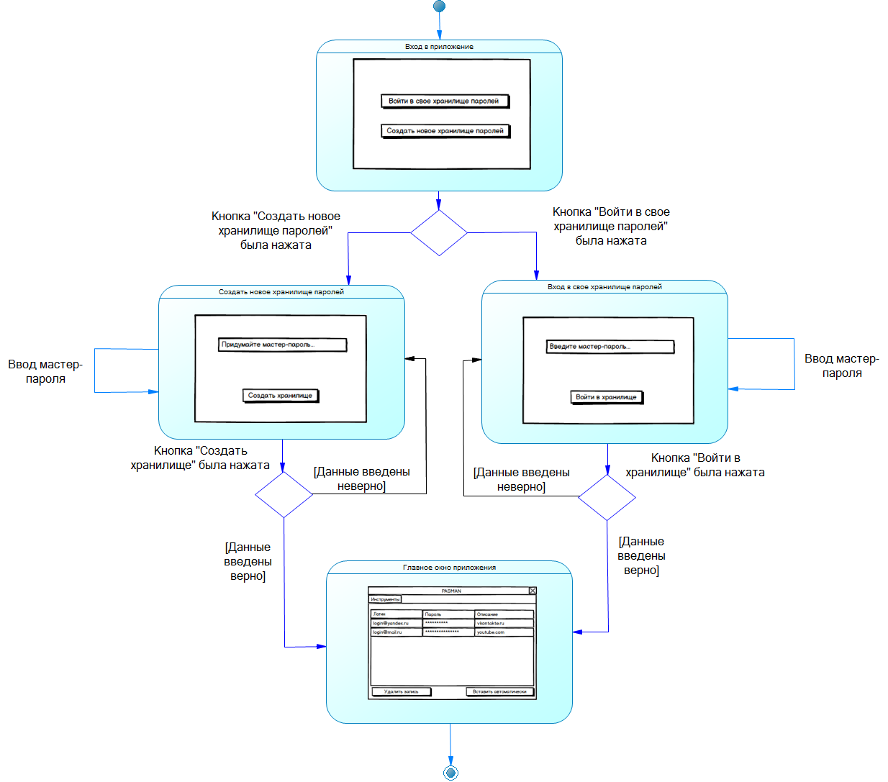
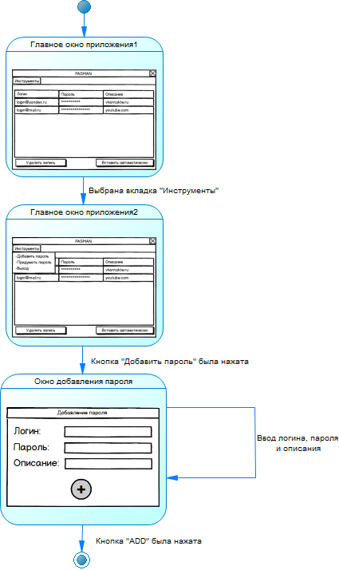
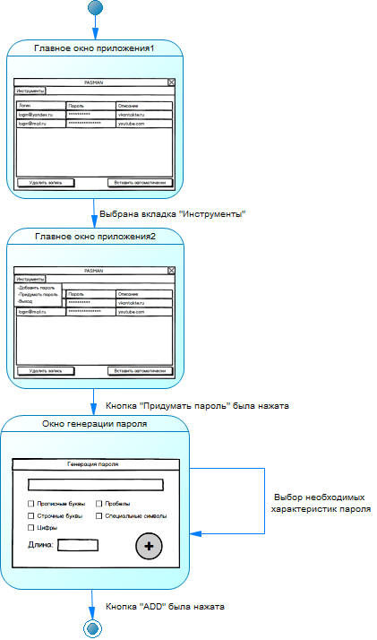

# Диаграмма состояний
---

# Содержание
1 [Вход в приложение](#create)  
2 [Добавление пароля](#add)  
3 [Генерация пароля](#gen)  

<a name="create"/>

# 1 Вход в приложение

<a name="add"/>

# 2 Добавление пароля

<a name="gen"/>

# 3 Генерация пароля

