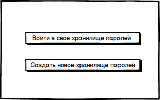
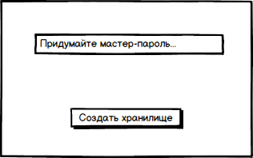
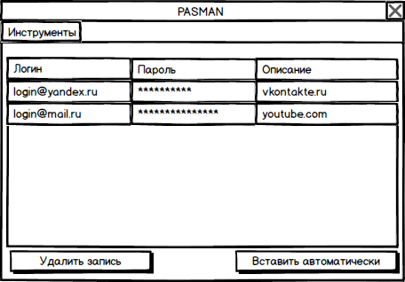
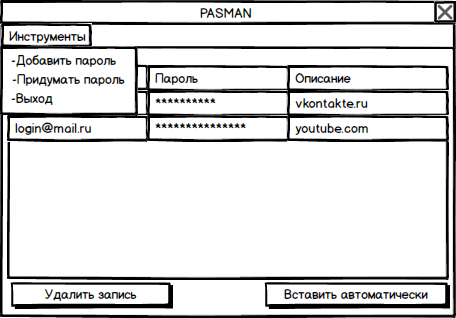
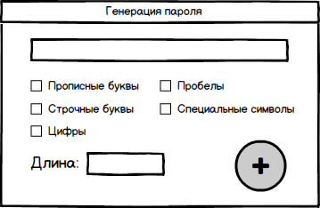
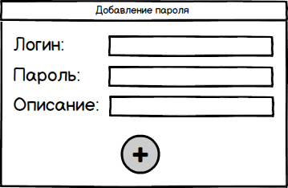

# Требования к проекту
---
## Содержание
# 1 Введение
## 1.1 Назначение
В этом документе описаны функциональные и нефункциональные требования к приложению «PASMAN» для ОС Windows 8,10.
## 1.2 Бизнес-требования
### 1.2.1 Исходные данные
Вопрос безопасности был актуальным во все времена. Однако сегодня, когда мы проводим значительную часть своего времени в интернете, он становится особенно важным. Несмотря на то, что существует множество способов аутентификации, пароль оказывается самым распространенным из них. К сожалению, он является и самым уязвимым. Для повышения безопасности пользователей, интернет сервисы советуют, а зачастую даже принуждают использовать длинные и сложные пароли. На первый взгляд это отлично, но как показывает практика, крайне неудобно. Особенно если учесть тот факт, что мы пользуемся десятками различных сайтов. Эту проблему и призваны решать менеджеры паролей.
### 1.2.2 Возможности бизнеса
Многие интернет-пользователи желают иметь приложение, которое предоставит возможность хранить все их пароли в одном безопасном месте. Подобное приложение позволит им сэкономить время при авторизациях, а также защитит от действий со стороны злоумышленников. Интерфейс, спроектированный с учетом того, что у человека могут быть десятки паролей, позволит пользователям с легкостью находить нужные из них. 
## 1.3 Аналоги
На данный момент создано большое количество менеджеров для хранения паролей. Например, 1Password, LastPass. Если сравнивать их с PASMAN, то они обходят его как по уровню безопасности, так и по числу дополнительных функций. Но, несмотря на это, PASMAN справляется с основной задачей подобных менеджеров, а именно обеспечивает хранение паролей и предоставляет возможность их эффективного использования. 

| Функции |1Password| LastPass | eWallet | PASMAN
| - | :-: | :-: | :-: | :-:
|Механизм шифрования |AES-256|AES-256|AES-256|XOR-шифрование
|Генератор паролей | +|+|+|+
|Автозаполнение |+|+|+|+
|Поиск | +|+|+|-
|Интеграция с браузером | +|+|+|-
|Стоимость |от 49,99$|1$|19,99$|Free

## 2 Требования пользователя
### 2.1 Программные интерфейсы
Проект использует фреймворк Qt, а также функции Win32 API.
### 2.2 Интерфейс пользователя
Окно входа в приложение.   

Окно создания нового хранилища паролей.  

Окно входа в своё хранилище паролей.  

Главное окно приложения.  

Главное окно приложения после нажатия на кнопку "Инструменты".  

Окно генерации пароля.

  

Окно добавления нового пароля.  
  
## 2.3 Характеристики пользователей 
### 2.3.1 Классы пользователей
| Класс пользователей | Описание |
|:---|:---|
| Новый пользователь | Человек, который использует приложение и ещё не создал хранилище паролей |
| Пользователь | Человек, который использует приложение с созданным хранилищем паролей |
### 2.3.2 Аудитория приложения
#### 2.3.2.1 Целевая аудитория
Люди, которые используют много интернет-сервисов, и имеющие большое количество аккаунтов на различных сайтах.
# 3 Системные требования
## 3.1 Функциональные требования
### 3.1.1 Основные функции
#### 3.1.1.1 Вход пользователя в приложение
**Описание.** Пользователь имеет возможность осуществить вход в приложение, используя мастер-пароль.

| Функция | Требования | 
|:---|:---|
| Вход в приложение | При успешной аутентификации приложение должно предоставить доступ к основным функциям приложения, иначе, при ошибке аутентификации, приложение должно сообщить об этом пользователю. |

#### 3.1.1.2 Создание нового мастер-пароля
**Описание.** Пользователь имеет возможность создать новый мастер-пароль.

| Функция | Требования | 
|:---|:---|
| Создание нового мастер-пароля |   Приложение должно предоставить пользователю поле для ввода мастер-пароля. При правильном заполнении и нажатии на кнопку "Создать новый", пользователь сможет использовать этот пароль для входа в приложение.  |

#### 3.1.1.3 Отображение паролей пользователя
**Описание.** Пользователь имеет возможность просматривать пароли, которые находятся в его базе данных.

| Функция | Требования | 
|:---|:---|
| Отображение паролей |  Приложение должно предоставить пользователю возможность просматривать пароли, которые он добавлял ранее.   |

#### 3.1.1.4 Добавление пароля в базу данных.
**Описание.** Пользователь имеет возможность добавлять новый пароль.

| Функция | Требования | 
|:---|:---|
| Добавление нового пароля | Приложение должно предоставить пользователю поля для ввода логина, пароля и описания для них. При правильном заполнении, приложение сообщит об этом, и, при возвращении в главное меню, в таблице появится строка с введенными данными.   |

#### 3.1.1.5 Генерация пароля.
**Описание.** Пользователь имеет возможность получать пароль, состоящий из случайных символов.

| Функция | Требования | 
|:---|:---|
| Генерация пароля | Приложение должно предоставить пользователю возможность выбирать из каких типов символов будет состоять пароль. После выбора необходимых пунктов, приложение должно сгенерировать пароль, состоящий из случайных символов.  |

#### 3.1.1.6 Удаление пароля из базы данных.
**Описание.** Пользователь имеет возможность удалять пароль из базы данных.

| Функция | Требования | 
|:---|:---|
| Удаление пароля |Приложение должно предоставить пользователю возможность выбрать из списка существующих паролей, тот, который необходимо удалить. После выбора пароля и нажатии кнопки "Удалить пароль" он исчезнет из базы данных, и больше не будет отображаться в таблице главного меню.|

#### 3.1.1.7 Автоматическая авторизация.
**Описание.** Пользователь может воспользоваться функцией автоматической авторизации.

| Функция | Требования | 
|:---|:---|
| Автоматическая авторизация  |Пользователь должен установить курсор мыши в поле, где необходимо вставить пароль. Далее приложение должно предоставить пользователю возможность выбрать из списка существующих паролей, тот, который необходимо вставить автоматически. После выбора пароля и нажатии кнопки "Вставить автоматически", окно приложения свернется, и в поле для ввода пароля появится выбранный пароль, а в буфере обмена будет находиться нужный логин.|

### 3.1.2 Ограничения и исключения
Приложение запускается и работает только на OC Windows 8,10.

## 3.2 Нефункциональные требования

### 3.2.1 Атрибуты качества
##### 3.2.1.1 Требования к удобству использования
1. Все элементы должны быть светлыми;
2. Все функциональные элементы пользовательского интерфейса имеют названия, описывающие действие, которое произойдет при выборе элемента;
##### 3.2.1.2 Требования к безопасности
Пароли пользователя должны храниться в зашифрованном виде.
### 3.2.2 Внешние интерфейсы
Окна приложения удобны для использования пользователями с плохим зрением:
- функциональные элементы контрастны фону окна.
### 3.2.3 Ограничения 
1. Данные пользователя хранятся в файле с расширением txt, название файла pass.txt
2. Если пользователь забудет мастер-пароль, то он потеряет доступ к базе данных с его паролями.

